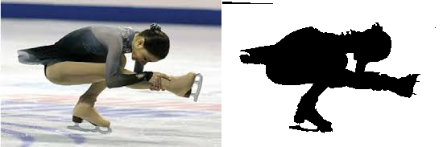
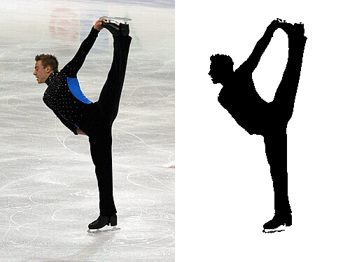

## Applications

This simple image processing approach segments skater silhouettes from images, providing data that can be used to train machine learning models. By analyzing segmented frames, models can determine skater spin positions, types (e.g., camel, sit spin), number of revolutions, and other figure skating analytics. This enables automated analysis for training, competition judging, or performance tracking.

## Techniques Used

The script employs several image processing and machine learning techniques to achieve accurate segmentation:

- **KMeans Clustering**: Pixels are grouped into clusters based on their RGB color values. This helps distinguish between ice (bright, low-saturation colors) and the skater (more colorful and varied hues). The number of clusters can be adjusted for better separation.

- **Connected Components Analysis**: After masking non-ice pixels, the script uses scipy's ndimage to find connected regions. It scores each component based on color variance, aspect ratio, and size to select the most likely skater parts, excluding small or irregular artifacts.

- **Flood Fill Techniques**: Region growing is applied to refine boundaries. It starts from seed pixels and expands based on color similarity thresholds, ensuring ice areas are filled white and skater areas are filled black. This includes removing horizontal line artifacts (e.g., rink boards) that span more than 75% of the image width, as they are unlikely to be part of a skater's silhouette, and filling small holes inside the skater silhouette.

These methods work together to handle complex scenes with varying lighting and backgrounds, producing a clean binary mask.




## Usage

Run the script from the command line in your terminal:

```
python skater_segment_final.py <image_path> [output_path] [n_clusters]
```


### Arguments:
- `<image_path>`: Path to the input image file (required). Supports common formats like JPG, PNG.
- `[output_path]`: Path to save the segmented silhouette image (optional). Defaults to `silhouette.png` if not provided.
- `[n_clusters]`: Number of clusters for KMeans clustering (optional). Defaults to 10. Higher values may improve accuracy but increase processing time.

## Notes

- The script assumes the image contains a skater on ice. It may not work well for other scenes.
- Processing time depends on image size and `n_clusters`.
- If no suitable skater component is found, it saves a blank white image.
